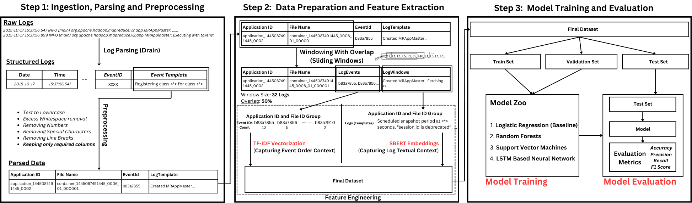

# MSCI641 Final Project
## Critical Logs Classification using Various Natural Language Processing

This repository contains all the code for our MSCI 641 Final Project.

## How to run the project

To run the project, follow these steps:

1. Clone the repository to your local machine:

    ```bash
    git clone https://github.com/your-username/your-repository.git
    ```

2. Navigate to the project directory:

    ```bash
    cd your-repository
    ```

3. Install the required dependencies:

    ```bash
    pip install -r requirements.txt
    ```

4. Download the dataset and place it in the `data` directory.

5. Preprocess the data by running the following command:

    ```bash
    python preprocess.py
    ```

6. Train the LSTM model by running the following command:

    ```bash
    python train.py
    ```

7. Evaluate the model by running the following command:

    ```bash
    python evaluate.py
    ```

8. Generate predictions for new logs by running the following command:

    ```bash
    python predict.py
    ```

## Project Usecase

We present a novel approach of classifying critical Hadoop system failures using the raw logs generated by the cluster while running the application. By leveraging various natural language processing techniques, we aim to accurately identify and classify different types of system failures, enabling faster troubleshooting and resolution.

## Project Design

The overall project design can be visualized in the following image:



## LSTM Model Architecture

The architecture of the LSTM model used for log classification is illustrated below:


